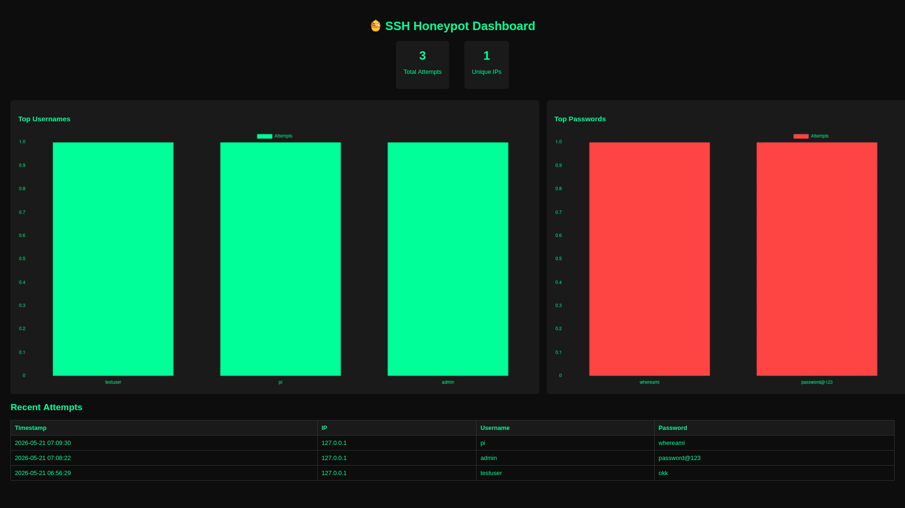

# 🍯 SSH Honeypot + Live Dashboard

A fake SSH server that captures real-world attacker behaviour 
and visualises it through a live web dashboard.

## 📌 What It Does
- Simulates a real SSH server to attract attackers
- Logs every login attempt (IP, username, password, timestamp)
- Displays captured data on a live Flask dashboard with charts

## 🛠️ Stack
- Python, Paramiko, SQLite, Flask, Chart.js

## ⚙️ Setup
```bash
git clone https://github.com/sleepyhead021/ssh-honeypot-dashboard
cd ssh-honeypot-dashboard
pip install -r requirements.txt
python src/honeypot.py
```

## 📸 Dashboard Preview


## 🔍 What I Learned
- How SSH handshakes and authentication work under the hood
- Network socket programming in Python
- Translating raw log data into meaningful visual insights
- Safe VM-isolated deployment practices

## ⚠️ Disclaimer
This tool is for educational purposes only. 
Only deploy on systems you own.
